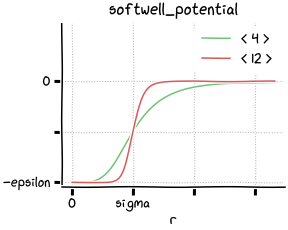

Potential energy
================

Common interface
----------------

Every potential class is a plain-old struct of parameters and provides two
functions :code:`evaluate_energy` and :code:`evaluate_force`.

.. code:: cpp

   struct binary_potential
   {
       ...

       md::scalar evaluate_energy(md::vector r) const;
       md::vector evaluate_force(md::vector r) const;
   };

Potentials
----------

.. list-table::

   * - `constant_potential`_
     - constant energy

   * - `harmonic_potential`_
     - harmonic oscillator

   * - `spring_potential`_
     - harmonic oscillator

   * - `semispring_potential`_
     - harmonic oscillator

   * - `lennard_jones_potential`_
     - Lennard-Jones 12-6

   * - `wca_potential`_
     - Lennard-Jones 12-6 with cut-off at the energy minimum

   * - `softcore_potential`_
     - soft-core repulsion

   * - `softwell_potential`_
     - soft-well attraction

References
----------

constant_potential
^^^^^^^^^^^^^^^^^^

.. figure:: _static/img/constant_potential.png
   :align: right

A potential with constant energy:

.. math::
   u(\boldsymbol{r}) = \varepsilon

harmonic_potential
^^^^^^^^^^^^^^^^^^

A long-range, attractive potential of the form:

.. math::
   u(\boldsymbol{r}) = \frac{K}{2} r^2

spring_potential
^^^^^^^^^^^^^^^^

.. figure:: _static/img/spring_potential.png
   :align: right

A long-range, attractive potential of the form:

.. math::
   u(\boldsymbol{r}) = \frac{K}{2} \left( r - b \right)^2

semispring_potential
^^^^^^^^^^^^^^^^^^^^

.. figure:: _static/img/semispring_potential.png
   :align: right

A long-range, attractive potential of the form:

.. math::
   u(\boldsymbol{r}) = \frac{K}{2} \left( r - b \right)^2
   \qquad
   \left( r > b \right)

lennard_jones_potential
^^^^^^^^^^^^^^^^^^^^^^^

.. figure:: _static/img/lennard_jones_potential.png
   :align: right

A long-range potential of the form:

.. math::
   u(\boldsymbol{r})
     = \varepsilon \Big(
         \Big( \frac{\sigma}{r} \Big)^{12} -
         \Big( \frac{\sigma}{r} \Big)^6
       \Big)

soft_lennard_jones_potential
^^^^^^^^^^^^^^^^^^^^^^^^^^^^

.. figure:: _static/img/soft_lennard_jones_potential.png
   :align: right

A long-range potential of the form:

.. math::
   u(\boldsymbol{r})
     = \varepsilon \left(
       \frac{k + 1}{k + (r / \sigma)^6}
       - 1
     \right)^2

wca_potential
^^^^^^^^^^^^^

A short-range, repulsive potential of the form:

.. math::
   u(\boldsymbol{r})
     = \varepsilon \Big(
         \Big( \frac{\sigma}{r} \Big)^{12} -
         \Big( \frac{\sigma}{r} \Big)^6
       \Big)
   \quad
   \left( r < \sigma \right)

softcore_potential
^^^^^^^^^^^^^^^^^^

A short-range, repulsive potential of the form:

.. math::
   u(\boldsymbol{r})
     = \varepsilon \Big(
         1 -
         \Big( \frac{r}{\sigma} \Big)^p
       \Big)^q
   \quad
   \left( r < \sigma \right)

softwell_potential
^^^^^^^^^^^^^^^^^^

A long-range, attractive potential of the form:

.. math::
   u(\boldsymbol{r})
     = -\frac{\varepsilon}{1 + (r / \sigma)^p}

.. code:: cpp

   md::softwell_potential<4> pot = {
       .energy         = 2.0,   // epsilon
       .decay_distance = 0.5    // sigma
   };

