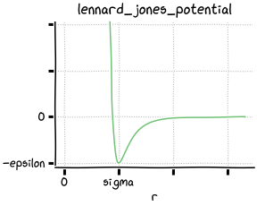

Potentials
==========

Common interface
----------------

MicroMD provides various pairwise potential functions as classes. Every
potential class is a plain-old struct of its parameters, and provides two
member functions :code:`evaluate_energy` and :code:`evaluate_force`.

.. code:: cpp

   // Create a Lennard-Jones potential with these parameters.
   md::lennard_jones_potential pot = {
       .epsilon = 1,
       .sigma   = 0.1
   };
   
   // Evaluate the energy e and the force F at distance r.
   md::vector r = {0.1, 0.2, 0.3};
   md::scalar e = pot.evaluate_energy(r);
   md::vector F = pot.evaluate_force(r);

Potential classes are designed to be lightweight. Use of a potential class
should be inlined by the compiler as if you have coded a raw formula of the
energy or the force.

Potential classes
-----------------

MicroMD defines these potential classes in the namespace :code:`md`:

.. list-table::

   * - `constant_potential`_
     - Constant energy

   * - `harmonic_potential`_
     - Harmonic spring

   * - `spring_potential`_
     - Harmonic spring with shifted center

   * - `semispring_potential`_
     - Harmonic spring without repulsive part

   * - `lennard_jones_potential`_
     - Lennard-Jones 12-6

   * - `soft_lennard_jones_potential`_
     - Modified, non-diverging Lennard-Jones 12-6

   * - `softcore_potential`_
     - Soft-core repulsion

   * - `softwell_potential`_
     - Soft-well attraction

constant_potential
^^^^^^^^^^^^^^^^^^

A potential with constant energy:

.. math::
   u(\boldsymbol{r}) = \varepsilon

.. code:: cpp

   struct constant_potential
   {
       md::scalar energy = 0.0; // epsilon
   }

harmonic_potential
^^^^^^^^^^^^^^^^^^

.. figure:: _static/img/harmonic_potential.png
   :align: right

A long-range, attractive potential of the form:

.. math::
   u(\boldsymbol{r}) = \frac{K}{2} r^2

.. code:: cpp

   struct harmonic_potential
   {
       md::scalar spring_constant = 1.0; // K
   }

spring_potential
^^^^^^^^^^^^^^^^

.. figure:: _static/img/spring_potential.png
   :align: right

A long-range, attractive potential of the form:

.. math::
   u(\boldsymbol{r}) = \frac{K}{2} \left( r - b \right)^2

.. code:: cpp

   struct spring_potential
   {
       md::scalar spring_constant      = 1.0; // K
       md::scalar equilibrium_distance = 0.0; // b
   }

The force calculation of :code:`spring_potential` involves a division, which is
computationally expensive. Prefer :code:`harmonic_potential` if you are sure
that the b parameter is zero.

semispring_potential
^^^^^^^^^^^^^^^^^^^^

.. figure:: _static/img/semispring_potential.png
   :align: right

A long-range, attractive potential of the form:

.. math::
   u(\boldsymbol{r}) = \frac{K}{2} \left( r - b \right)^2
   \qquad
   \left( r > b \right)

.. code:: cpp

   struct semispring_potential
   {
       md::scalar spring_constant      = 1.0; // K
       md::scalar equilibrium_distance = 0.0; // b
   }

lennard_jones_potential
^^^^^^^^^^^^^^^^^^^^^^^

A long-range potential of the form:

.. math::
   u(\boldsymbol{r})
     = \varepsilon \Big(
         \Big( \frac{\sigma}{r} \Big)^{12} -
         2 \Big( \frac{\sigma}{r} \Big)^6
       \Big)

.. code:: cpp

   struct lennard_jones_potential
   {
       md::scalar epsilon = 1.0;
       md::scalar sigma   = 1.0;
   }

The potential energy diverges at r = 0. Use of this potential in a molecular
dynamics simulation can cause numerical instability (NaNs and infinities). In
that case you may want to use :code:`soft_lennard_jones_potential` instead.

soft_lennard_jones_potential
^^^^^^^^^^^^^^^^^^^^^^^^^^^^

A long-range potential of the form:

.. math::
   u(\boldsymbol{r})
     = \varepsilon \left(
       \frac{k + 1}{k + (r / \sigma)^6}
       - 1
     \right)^2 - \varepsilon

.. code:: cpp

   struct soft_lennard_jones_potential
   {
       md::scalar softness = 0.1; // k
       md::scalar epsilon  = 1.0;
       md::scalar sigma    = 1.0;
   }

This potential approaches the Lennard-Jones 12-6 potential as k gets to zero.

softcore_potential
^^^^^^^^^^^^^^^^^^

.. figure:: _static/img/softcore_potential.png
   :align: right

A bell-shaped repulsive potential of the form:

.. math::
   u(\boldsymbol{r})
     = \varepsilon \Big(
         1 -
         \Big( \frac{r}{\sigma} \Big)^p
       \Big)^q
   \quad
   \left( r < \sigma \right)

.. code:: cpp

   template<int P, int Q>
   struct softcore_potential
   {
       md::scalar overlap_energy  = 1.0; // epsilon
       md::scalar cutoff_distance = 1.0; // sigma
   }

The potential becomes fatter as p gets larger. Also the cutoff at sigma becomes
smoother as q gets larger. The function approximates the gaussian function
fairly well when p = 2 and q = 3 or 4.

softwell_potential
^^^^^^^^^^^^^^^^^^

.. figure:: _static/img/softwell_potential.png
   :align: right

A well-like attractive potential of the form:

.. math::
   u(\boldsymbol{r})
     = -\frac{\varepsilon}{1 + (r / \sigma)^p}

.. code:: cpp

   template<int P>
   struct softwell_potential
   {
       md::scalar energy         = 1.0; // epsilon
       md::scalar decay_distance = 1.0; // sigma
   }

It works as an energy barrier. Larger p makes the barrier steeper.

Linear combination
------------------

All the potential classes in the :code:`md` namespace support scalar
multiplication and addition:

.. code:: cpp

   md::lennard_jones_potential lennard_jones = {
       .epsilon = 1,
       .sigma   = 0.1
   };
   md::harmonic_potential harmonic = {
       .spring_constant = 10
   };
   
   // Linear combination of Lennard-Jones and harmonic potentials.
   auto pot = 0.5 * lennard_jones + harmonic;
   
   // The resulting potential object is usable just like other ones.
   md::vector r = {0.1, 0.2, 0.3};
   md::scalar e = pot.evaluate_energy(r);
   md::vector F = pot.evaluate_force(r);

Writing a custom potential
--------------------------

.. code:: cpp

   struct my_custom_potential
   {
       md::scalar spring_constant = 1;

       md::scalar evaluate_energy(md::vector r) const;
       md::vector evaluate_force(md::vector r) const;
   };
